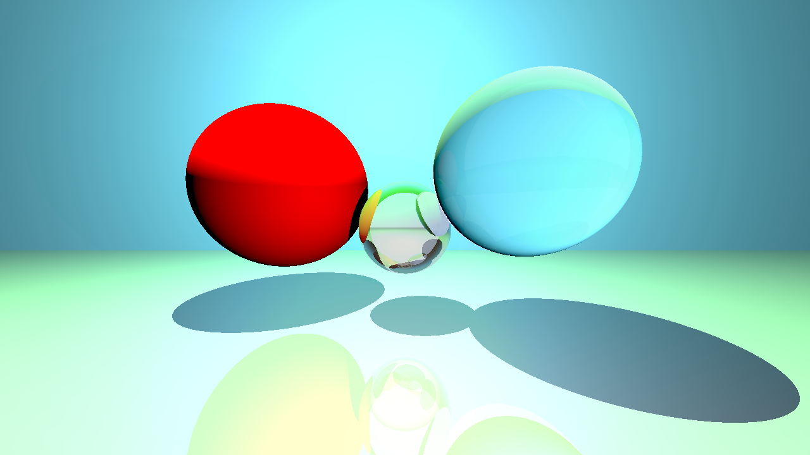

# 🎺 ToyTracer
> CMPM 164, Fall 2019

This repo is for homework 2B. 

A naive toy Ray Tracer built from ~~scract~~ (given up), used a third-party library [OpenGL Mathematics](https://github.com/g-truc/glm) (*GLM*). 

## Outputs



With 1280x720, Gama 2.2, FoV 90, Max Recursion Depth 10.  

## Features

- `Phong Lighting`: Has 3 solid spherical objects with 2 shperical lights and 1 directional light using the Phong lighting model.
- `Relection & Refraction`: Have 3 spherical objects different material, including shadows.
- `Additonal Shapes`: Have Triangle shape, Plane shape.
- `Fresnel Effect`
- `Gamma Correction`
- `Modern C++ Practices`

## Sample Code

Sphere Implementation

```c++

#pragma once

#include <glm/gtx/intersect.hpp>

#include "Element.h"

class Sphere : public Element
{
public:
   Sphere(Material material, const glm::vec3& center, const float radius) :
      Element(material),
      origin_(center),
      radius_(radius)
   {
   }

   bool Intersect(const Ray& ray, float& dist) override
   {
      return intersectRaySphere(
         ray.GetOrigin(), ray.GetDirection(),
         origin_, radius_ * radius_,
         dist
      );
   }

   glm::vec3 GetSurfaceNormal(glm::vec3& hit_point) override
   {
      return (hit_point - origin_) / radius_; // from glm
   }

   glm::vec2 TextureCoords(glm::vec3& hit_point) override
   {
      const auto hit_vec = hit_point - origin_;

      return {
         (1.0 + atan2(hit_vec.z, hit_vec.x)) / glm::pi<float>() * 0.5f,
         acos(hit_vec.y / radius_) / glm::pi<float>()
      };
   }

private:
   glm::vec3 origin_;
   float radius_;
};

```

## Meta

Yanwen Xu – [UCSC](https://people.ucsc.edu/~yxu83/) – yxu83@ucsc.edu

